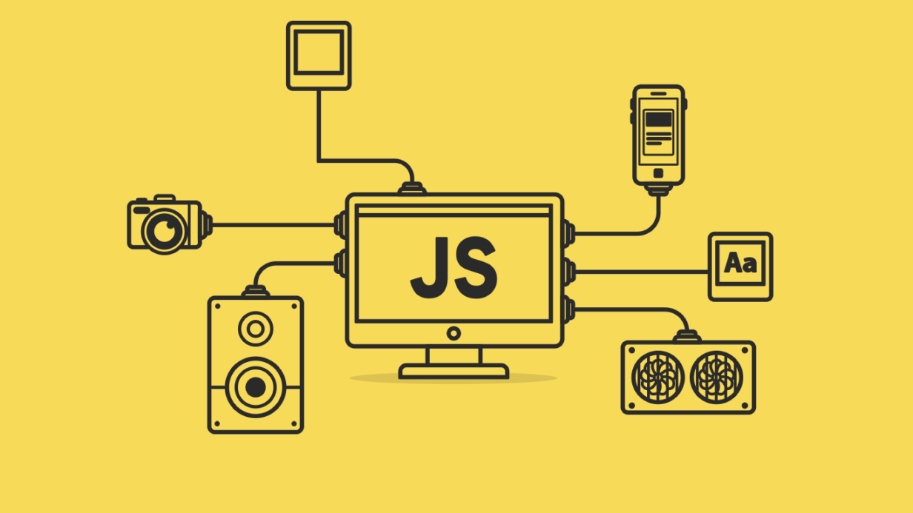

# *Repositório JavaScript*

### Repositório exclusivo para o estudo de JavaScript. Nesse repositório estão alocadas as aulas de JavaScript básico e intermediário do Start Tech - Gama Academy e do curso Formação Básica (JavaScript) do LinkedIn Learning.

### START TECH

#### ASSUNTOS ABORTADOS NO MÓDULO 4 (BÁSICO):

* Números e Operadores
* Boas Práticas de JavaScript
* Condicionais
* Estruturas de Repetição
* Funções
* Classes
* Desafio do Módulo 4: Validador de CPF.
##### Extra: Tabuada: Exercicio de fixação da Estrutura de Repetição FOR.

#### ASSUNTOS ABORTADOS NO MÓDULO 5 (INTERMEDIÁRIO):

* Template String
* Operador Ternário e Arrow Functions
* Spread
* Desestruct e Match
* SPA, PWA e WebComponents.

### LINKEDIN LEARNING

#### - Introdução ao JavaScript

* O que é JavaScript
* JavaScript vs Java: Qual a diferença?
* Explore o panorama do JavaScript

#### - Elementos Básicos do JavaScript

* Ferramentas e Recursos para desenvolvimento em JavaScript
* Introdução ao Console Navegador
* Adicione JavaScript em linha a um documento HTML
* Adicione JavaScript a um arquivo externo
* Boas Práticas ao utilizar o Javascript

#### - Manipulação de Dados

* Como utilizar variáveis
* Tipos de Dados que podem ser armazenados em variáveis
* Matemática básica: usando operadores aritméticos
* Como interagir com números e Strings
* Teste condições utilizando operadores lógicos
* Teste condições avançadas utilizando operadores lógicos
* Armazene vários itens de uma vez só com arrays (Vetores e Matrizes)
* Propriedades e Métodos dos Arrays

#### - Funções e Objetos

* Estruture e Reutilie suas instruções com funções.
* Crie uma função nomeada básica
* Adicione argumentos a uma função
* Retorne valores de uma função
* Como funcionam asfunções anonimas
* Expressões de funções invocadas imediatamente
* Entenda onde suas variáveis são disponíveis dados seus escopos
* Defina variáveis com const e let
* Entenda como objetos funcionam
* Construtores de Objetos
* Acesse propriedades utilizando as notações dot e bracket
* Closures

#### - Manipulando Elementos no DOM

* DOM: O Modelo de Objeto de Documento
* Aja sobre elementos no DOM usando métodos querySelector
* Acesse e mude elementos
* Acesse e mude classes
* Acesse e mude atributos
* Adicione e remova elementos do DOM
* Aplique CSS em linha a um elemento

#### - Projeto - Relógio Analógico

#### - Manipulando elementos no DOM: Parte 2

* O que são os eventos DOM?
* Eventos que provavelmente vocÊ irá usar
* Gatilho de funções com manipuladores de eventos
* Adicione e use Listeners de Eventos
* Passe argumentos através de listeners de eventos

#### - Projeto - O Quão Rápido Você Digita?

#### - Laços de Repetição

* Como usar loops ou laços de repetição
* Percorrendo arrays com laços de repetição
* Como usar comands break e continue

#### - Projeto - Trabalhando com Imagens de Forma Responsiva

#### - Troubleshooting, Validação e Minificação

* Validação e Trobleshooting de JavaScript
* Trobleshooting de JavaScript
* Envie informações de trobleshooting para o console
* Debugue o seu JavaScript utilizando as ferramentas do seu browser
* Use um linter para acusar erros
* Use um linter para acusar erros automaticamente
* Minifique o script
* Automatize a minificação do script
